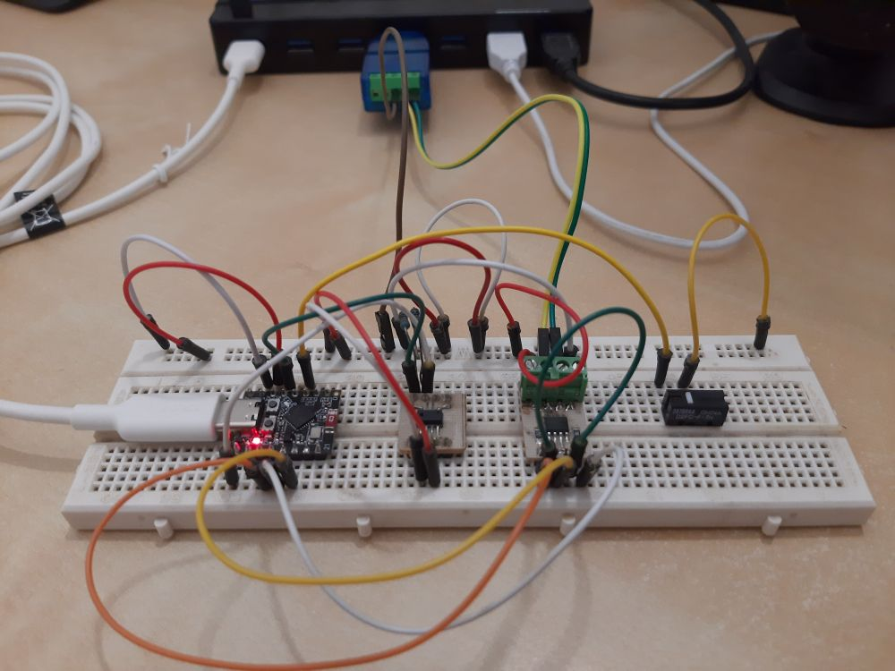
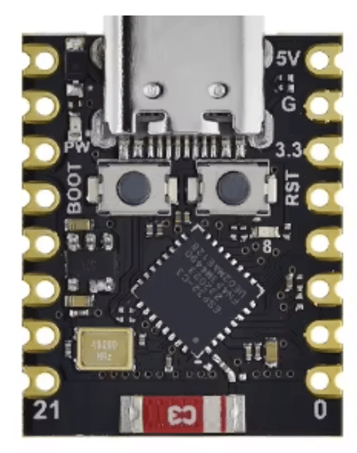
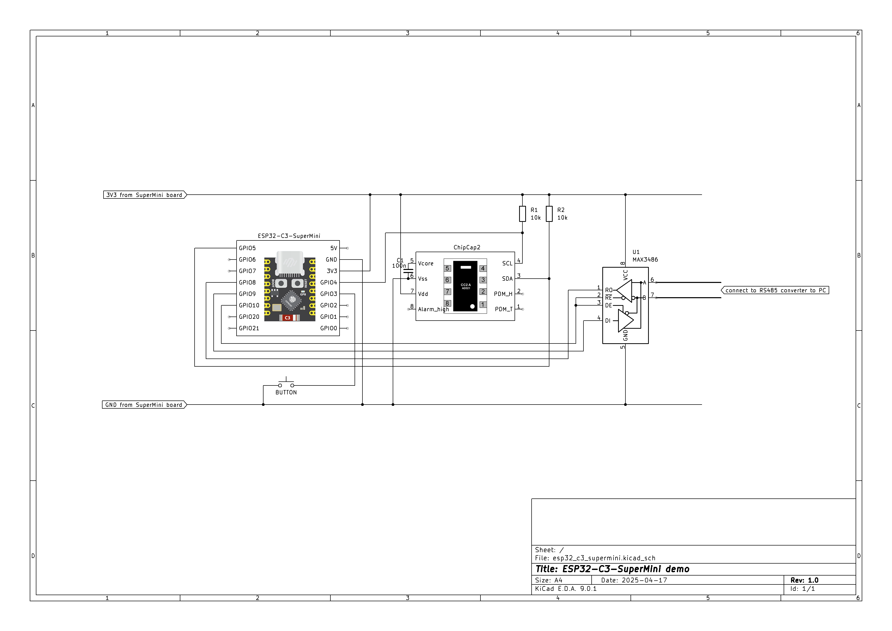
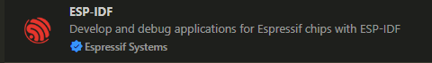
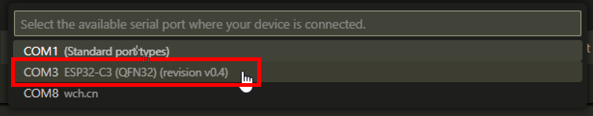
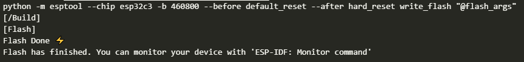

# Demo VSCode project for the **Espressif ESP32-C3-Supermini** development board

This project uses the ESP32-C3-Supermini development board to demonstrate the various capabilities of the board, from the **Wi-Fi** peripheral to the **GPIO**. The project was created with `Visual Studio Code` using the `ESP-IDF` extension, from the minimal `template-app` project template. This `README` will give detailed information on the project itself and how to build it using `Visual Studio Code` with the `ESP-IDF` extension.

<div style="display: flex; align-items: center; gap: 10px;">
    
    
</div>

## Description

### Program Operation Overview

The core functionality of the firmware is as follows:

- Initialize all peripherals and connect to a Wi-Fi network.
- Connect to a public MQTT broker (`mqtts://mqtt.eclipseprojects.io`).
- Read data from a humidity/temperature sensor and publish it to the MQTT broker on the following events:
  - Periodically (every 5 seconds)  
  - On a button press  
  - Upon receiving a special MQTT message (`read-and-publish`)
- Update Wi-Fi credentials via provisioning when the button is **pressed and held** (`PROVISIONING` mode).
- Perform an **Over-The-Air (OTA) firmware update** upon receiving a special MQTT message (`upgrade-firmware`).


### **ESP32-C3-Supermini** showcase functionality overview:

- The **Wireless** peripheral, which will:
  - Connect to a **Wi-Fi** network
  - Communicate with an **MQTT broker** using a secure connection (**TLS**)
  - Allow changing Wi-Fi settings via **Espressif's Mobile BLE Provisioning** app (using **Bluetooth**)
  - Perform an OTA (Over-The-Air) firmware update
- The **UART** peripheral, which will:
  - Communicate with a computer through an **RS485 converter (MAX3486)**
- The **I2C** peripheral, which will:
  - Read data from a **ChipCap2 humidity/temperature sensor**
- The **GPIO** peripheral, which will:
  - Read a **button state**
  - Control an **LED** for simple visual signaling
- The **FreeRTOS** operating system features:
  - Tasks
  - Timers
  - Queues


### Firmware Overview

The firmware initializes all components in the following order:

- **UART** – Communication with the PC  
- **GPIO** – Button and LED control  
- **Queues** – Communication queues between various tasks  
- **I2C** – Communication with the `ChipCap2` humidity and temperature sensor  
- **Wireless connections** – Wi-Fi and Bluetooth Low Energy (BLE)  
- **MQTT client** – Communication with an MQTT broker using TLS  
- **Timers** – One for detecting **button hold** events and another periodic timer (every **5 seconds**) for reading sensor data and publishing it to the MQTT broker  
- **GPIO Task** – Monitors button presses

> **Note:** When the firmware is flashed for the first time, it will pause during the **Wireless connection** initialization and wait until initial `PROVISIONING` is completed. Provisioning means configuring the SSID and credentials for the Wi-Fi network the board should connect to. `PROVISIONING` is explained in the next section.

After successful initialization, the board's **blue LED** blinks 10 times to signal that all components have been initialized successfully.

The program then enters the main event loop and waits for the following events:

- **Button press**  
  - Triggers a reading from the `ChipCap2` sensor (humidity and temperature) and publishes the data to the MQTT broker  
  - Starts a timer to check for a **button hold** event

- **Button hold**  
  - If the button is held for more than 2 seconds, re-`PROVISIONING` is triggered. This stops the event loop and waits for Wi-Fi credentials to be re-entered, following the same procedure as the initial provisioning.

- **MQTT READ-AND-PUBLISH message received**  
  - When a specific MQTT message `"read-and-publish\r\n"` is received, the firmware reads from the `ChipCap2` sensor and publishes the data—same as with a button press.

- **MQTT UPGRADE-FIRMWARE message received**
  - When a specific MQTT message `"upgrade-firmware\r\n"` is received, the firmware **OTA (Over-The-Air) update** procedure is executed.

- **Periodic timer event**  
  - Every 5 seconds, the timer triggers a sensor read and data publish—same as with a button press.

- **MQTT connected**  
  - A notification is sent over UART indicating that the MQTT client has successfully connected to the broker.

- **MQTT disconnected**  
  - When the MQTT client disconnects for any reason, it immediately attempts to reconnect to the broker.


### Provisioning (Setting Wi-Fi Network and Connection Details)

The `PROVISIONING` process is how the board is configured with the SSID and password of a Wi-Fi network. This setup is done via **Bluetooth Low Energy (BLE)** and is triggered either on the **first boot** or anytime a **button hold** event is detected by the firmware.

To enter the credentials, use the official Espressif **ESP BLE Provisioning** app, available here:  
[ESP BLE Provisioning App on Google Play](https://play.google.com/store/apps/details?id=com.espressif.provble&hl=en-US)

#### Step-by-Step Provisioning Guide

1. The board enters **PROVISIONING mode** (on first boot or after a button hold).
2. It enables **Bluetooth Low Energy (BLE)** and waits for a connection from the mobile app.
3. When the app connects, the board requires a **Proof of Possession (PoP)** pin, which was set in the firmware.
4. If the pin is correct, the app shows a list of available Wi-Fi networks.
5. The user selects a network and enters its password.
6. Upon successful connection, the board:
    - Connects to the Wi-Fi network
    - Blinks the blue LED **10 times** to signal success

---

### OTA (Over-The-Air) Update

The **OTA update** mechanism allows the board to update its firmware by downloading a new `.bin` file over the network. This process is triggered by receiving a special MQTT message: **`UPDATE-FIRMWARE`**.

> **Note:**  
> To perform an OTA update, the `pytest_ota.py` script must be running in an IDF terminal. This script starts a local HTTPS server to serve the new firmware binary.  
>
> The default command is:  
> ```
> pytest_simple_ota.py bins 8070 components/ota_component
> ```  
> Ensure the `bins` directory exists and contains the new firmware as `upgrade.bin`.

#### OTA Update Steps

1. The board receives the `UPDATE-FIRMWARE` MQTT message.
2. It establishes a **TLS connection** to the local HTTPS server.
3. The new firmware binary is downloaded and written to the **secondary OTA partition**.
4. After a successful download:
    - The board sets the new partition as the boot target
    - It performs a **restart**, booting into the new firmware


## Setup

1. Setup the `ESP32-C3-Supermini` board and additional circuits as displayed on the circuit diagram below:

&nbsp;&nbsp;&nbsp;&nbsp;&nbsp;&nbsp;&nbsp;&nbsp;&nbsp;&nbsp;

2. Connect the `ESP32-C3-Supermini` board via the **USB-C** connector to your computer
3. Connecting the board should now add an extra **COM** port for programming the board to the computer's list of available **COM** ports
4. Download and install `Visual Studio Code` for your operating system from https://code.visualstudio.com/
5. Clone this repository onto your computer with the following command on the console:
```bash
git clone https://github.com/matkuki/esp32c3_supermini_demo
```
6. Open `Visual Studio Code` and install the ESP-IDF extension:

&nbsp;&nbsp;&nbsp;&nbsp;&nbsp;&nbsp;&nbsp;&nbsp;&nbsp;&nbsp;

7. In `Visual Studio Code` open the project directory where the git repository was cloned into
8. After the project is loaded, select the correct COM port from the COM port selector in the statusbar of `Visual Studio Code`:

&nbsp;&nbsp;&nbsp;&nbsp;&nbsp;&nbsp;&nbsp;&nbsp;&nbsp;&nbsp;
  
&nbsp;&nbsp;&nbsp;&nbsp;&nbsp;&nbsp;&nbsp;&nbsp;&nbsp;&nbsp;Then selecting the correct COM port for the `ESP32-C3-Supermini`:
  
&nbsp;&nbsp;&nbsp;&nbsp;&nbsp;&nbsp;&nbsp;&nbsp;&nbsp;&nbsp;

9. Run the `menuconfig` by opening an **ESP-IDF Terminal**:

&nbsp;&nbsp;&nbsp;&nbsp;&nbsp;&nbsp;&nbsp;&nbsp;&nbsp;&nbsp;

&nbsp;&nbsp;&nbsp;&nbsp;&nbsp;&nbsp;&nbsp;&nbsp;&nbsp;&nbsp;and then executing:

```bash
idf.py menuconfig
```

&nbsp;&nbsp;&nbsp;&nbsp;&nbsp;&nbsp;&nbsp;&nbsp;&nbsp;&nbsp;Enable the MQTT5 protocol with `[*] Enable MQTT protocol 5.0` under `Component config → ESP-MQTT Configurations`

&nbsp;&nbsp;&nbsp;&nbsp;&nbsp;&nbsp;&nbsp;&nbsp;&nbsp;&nbsp;Set the flashing size to `(X) 4 MB` under `Serial flasher config → Flash size`

&nbsp;&nbsp;&nbsp;&nbsp;&nbsp;&nbsp;&nbsp;&nbsp;&nbsp;&nbsp;Set the custom partition file to `partitions.csv` with the `(X) Custom partition table CSV` option, under `Partition Table → Partition Table`

&nbsp;&nbsp;&nbsp;&nbsp;&nbsp;&nbsp;&nbsp;&nbsp;&nbsp;&nbsp;Adjust all the other options under `Matic's configuration` as needed, to adjust the project defaults to your requirements, like the MQTT broker, I2C baud rate, ...

10. Build the project by pressing the `BUILD` button in the statusbar:

&nbsp;&nbsp;&nbsp;&nbsp;&nbsp;&nbsp;&nbsp;&nbsp;&nbsp;&nbsp;

11. Wait for the project to build (this takes a while)
12. Flash the project to the board by pressing the `FLASH` button in the statusbar:

&nbsp;&nbsp;&nbsp;&nbsp;&nbsp;&nbsp;&nbsp;&nbsp;&nbsp;&nbsp;

13. When the project is flashed successfully, the board's LED will turn blue and the communication with the computer through the RS485 communication will start producing messages, that can be observed in a COM port listener program (like `Open Serial Port Monitor` or `putty`)

&nbsp;&nbsp;&nbsp;&nbsp;&nbsp;&nbsp;&nbsp;&nbsp;&nbsp;&nbsp;

14. Alternatively, the board can be started in `Monitor` mode, by pressing the `Monitor Device` button in the statusbar:

&nbsp;&nbsp;&nbsp;&nbsp;&nbsp;&nbsp;&nbsp;&nbsp;&nbsp;&nbsp;

&nbsp;&nbsp;&nbsp;&nbsp;&nbsp;&nbsp;&nbsp;&nbsp;&nbsp;&nbsp;When the board is started in this mode, `Visual Studio Code` opens a terminal that communicates with the board through its primary **COM** port (over the **USB** cable), displaying information and error messages in the terminal.


